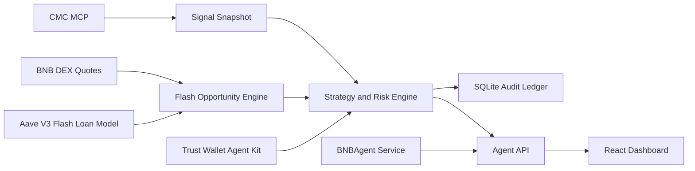

# TriStack Alpha Agent

AI flash-liquidity pool balancing for BNB Chain, dry-run first.

TriStack Alpha Agent is a self-custody AI trading agent for BNB Chain. It uses CoinMarketCap MCP as the signal layer, Trust Wallet Agent Kit as the local custody and execution guard, BNBAgent SDK as the on-chain identity / commerce layer, and Aave V3 as the modeled flash-liquidity source. The agent is dry-run by default, records every decision, and refuses execution unless market signal, token safety, quote quality, wallet state, and user-defined risk rules all pass.

Built by digitalmagic888 / OGWEBCHEF888

## 60-second explanation

Cross-DEX price differences on BNB Chain can exist for short windows. TriStack Alpha Agent treats those windows as pool-balancing opportunities, not investment advice. It discovers market context from CMC MCP, compares BNB DEX quotes, estimates Aave V3 flash-loan premium, DEX fees, slippage, gas, and stale-quote risk, then records a deterministic decision hash. Trust Wallet Agent Kit is the execution boundary: wallet checks, token risk checks, and quote-only swaps happen before any live path. BNBAgent SDK provides the agent identity and service manifest.

The shipped MVP demonstrates the complete decision loop in dry-run mode. No transaction is signed, broadcast, deployed, or executed by default.

## Sponsor stack proof

| Stack | Role | Current implementation |
| --- | --- | --- |
| CoinMarketCap MCP | Market signal and skill discovery | Mock/file adapter plus real-mode MCP instructions for `search_cryptos`, `get_crypto_quotes_latest`, and `get_global_metrics_latest` |
| Trust Wallet Agent Kit | Self-custody wallet and quote guard | TWAK command builder for auth, wallet, risk, portfolio, and quote-only swaps |
| BNBAgent SDK | Agent identity and commerce endpoint | Python manifest service with `/agent/manifest` and `/erc8183/status` |
| BNB Chain | Venue and testnet identity target | BSC-focused config, allowlists, and docs |
| Aave V3 | Flash liquidity source | Route economics engine and disabled Solidity proof receiver |

## Architecture



## Quick start

```bash
corepack enable
corepack prepare pnpm@9.15.4 --activate
pnpm install
pnpm lint
pnpm test
pnpm demo:dry-run
```

Start the agent API and dashboard:

```bash
pnpm agent:run
pnpm web:dev
```

Python identity service:

```bash
cd services/bnb-agent
python -m venv .venv
source .venv/bin/activate
pip install -e .[server]
cp .env.example .env
python register_agent.py --dry-run
uvicorn agent_server:app --port 8003
```


## Cloudflare Pages

For a standard Cloudflare Pages Vite deployment from the monorepo root:

```text
Build command: npm run build
Build output directory: apps/web/dist
Root directory: /
```

The root `build` script delegates to `@tristack/web`, so Cloudflare's default `npm run build` works without changing the monorepo layout.

## Environment variables

Copy `.env.example` to `.env` for local runs. Keep real values out of Git.

| Variable | Default | Meaning |
| --- | --- | --- |
| `LIVE_TRADING` | `false` | Must be true before any live execution path is considered |
| `FLASH_LOAN_EXECUTION` | `false` | Must be true before Solidity flash route execution is considered |
| `MAX_TRADE_USD` | `0` | Notional cap; zero blocks live execution |
| `MAX_DAILY_NOTIONAL_USD` | `0` | Daily cap; zero blocks live execution |
| `KILL_SWITCH` | `true` | Hard execution blocker |
| `CMC_MODE` | `mock` | `mock`, `file`, or `real` |
| `TWAK_MODE` | `mock` | `mock` or `real` |

## What works now

- Deterministic CMC signal normalization with mock/file mode.
- Aave flash-loan pool-balancing opportunity math.
- Strategy decision gates with explicit blocker reasons.
- Trust Wallet quote-only command construction.
- SQLite audit ledger writes.
- Dry-run artifact generation at `artifacts/demo-run-latest.json`.
- React dashboard for judge walkthrough.
- BNBAgent manifest service in dry-run mode.
- Solidity flash-loan receiver proof module and model tests.

## Mocked or manual in this MVP

- Live CMC MCP verification requires local Codex MCP config or `CMC_MCP_API_KEY`, using `https://mcp.coinmarketcap.com/mcp`.
- TWAK real wallet/risk/quote calls require Trust Wallet credentials outside the repo.
- Aave flash-loan execution contract is not deployed automatically.
- BNBAgent on-chain registration is dry-run unless wallet/RPC configuration is supplied intentionally.

## Safety model

This is strategy research and a hackathon demo. It is not investment advice and does not claim profitability. Execution is blocked by default through `LIVE_TRADING=false`, `FLASH_LOAN_EXECUTION=false`, `MAX_TRADE_USD=0`, and `KILL_SWITCH=true`. Every run records inputs, risk gates, decision reason, and a deterministic hash.
