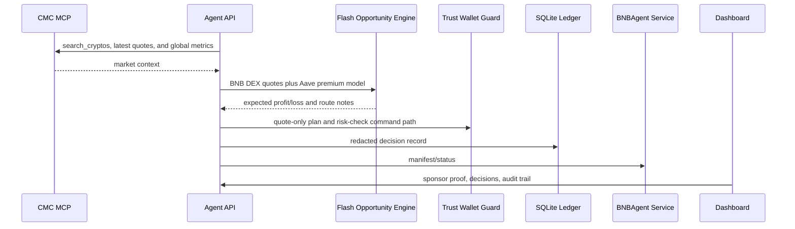

# Architecture

TriStack Alpha Agent is organized as a dry-run-first decision pipeline.

The production shape keeps live chain actions behind explicit environment flags and operator review. The MVP makes every important integration visible without requiring private credentials.
